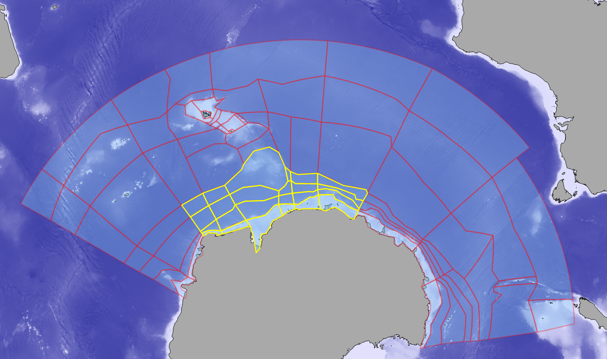

# Development and calibration for the Antarctic Atlantis model
This repository contain the input files, development notes and visualizations for development and calibration of the East Antarctic Atlantis model (28 box version)

